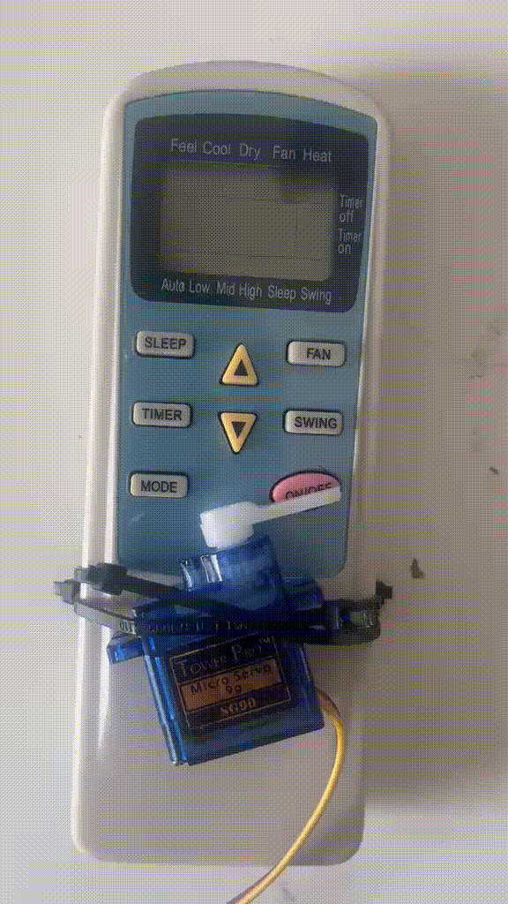
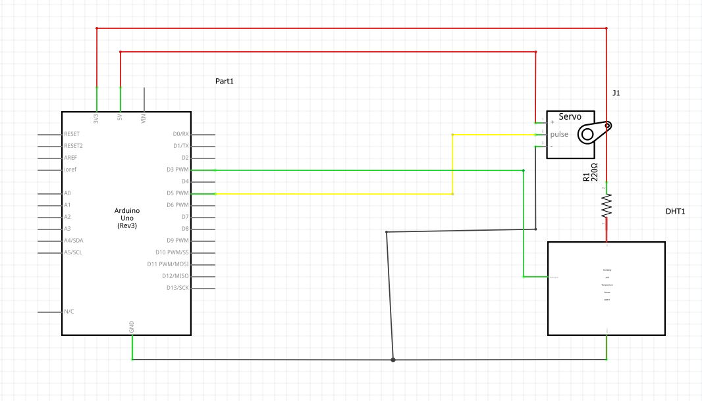

# Ac_temp_Control_With_Linux_Data_Logger
An arduino project that turns the ac on/off to keep a constant temperature in a room with a data logger tracking the temperature and the air conditioning state over time.

## Why i did it?
With energy becoming expensive i needed a way to keep my room at a reasonable temperature without keeping my air conditioning on constantly.

## Overview

The system reads room temperature every 2 minutes using a DHT11 sensor. If the temperature rises above **25°C**, a servo physically "presses" the AC's power button to turn it on. Once the temperature drops below **22°C**, the servo presses the button again to turn it off. This on/off gap (instead of a single threshold) prevents the system from rapidly flickering the AC on and off right at the boundary — the same approach real thermostats use.

## How It Works

1. DHT11 reads the room temperature.
2. The reading is compared against two thresholds:
   - Temp > 25°C and AC currently off → turn AC on
   - Temp < 22°C and AC currently on → turn AC off
   - Otherwise → do nothing (AC stays in its current state)
3.  A servo sweeps from a neutral position to press the AC's physical power button, then returns to neutral.
    The cycle runs every 2 minutes, since room temperature changes slowly and doesn't need faster polling.

   **Video of the servo pressing the button:**

   
   

## Hardware Used
- Arduino Uno
- DHT11 temperature/humidity sensor (3-pin module)
- SG90 Servo
- Wires
  
   **Schematic:**

## Challenges & Debugging

**DHT11 returning error -3 (connect error)**
Initial wiring had the signal S and power + pins swapped on the 3-pin module. The sensor never received power correctly, so it couldn't respond to the Arduino's request. Fixed by rewiring according to the module's actual pin labels.

**Servo buzzing and DHT11 errors reappearing once the servo was added**
After wiring the servo, it buzzed instead of moving cleanly, and the DHT11 showed errors again (-4, ACK stuck low).It traced back to the same problem, the servo and DHT11 were sharing the Arduino's 5V rail. The power wasn`t enough for both components so neither worked.

Attempted fixes that **didn't** work:
- A 9V battery + 220Ω resistor for the servo — The buzzing did not stop,probably because it still was not enough power in the battery or the servo was overloaded.
- Powering the DHT11 and servo from a second 9V battery — they were both curent starved.

**What actually fixed it:**
Powering the DHT11 from Arduino 3.3V pin and the servo from the 5V pin.

